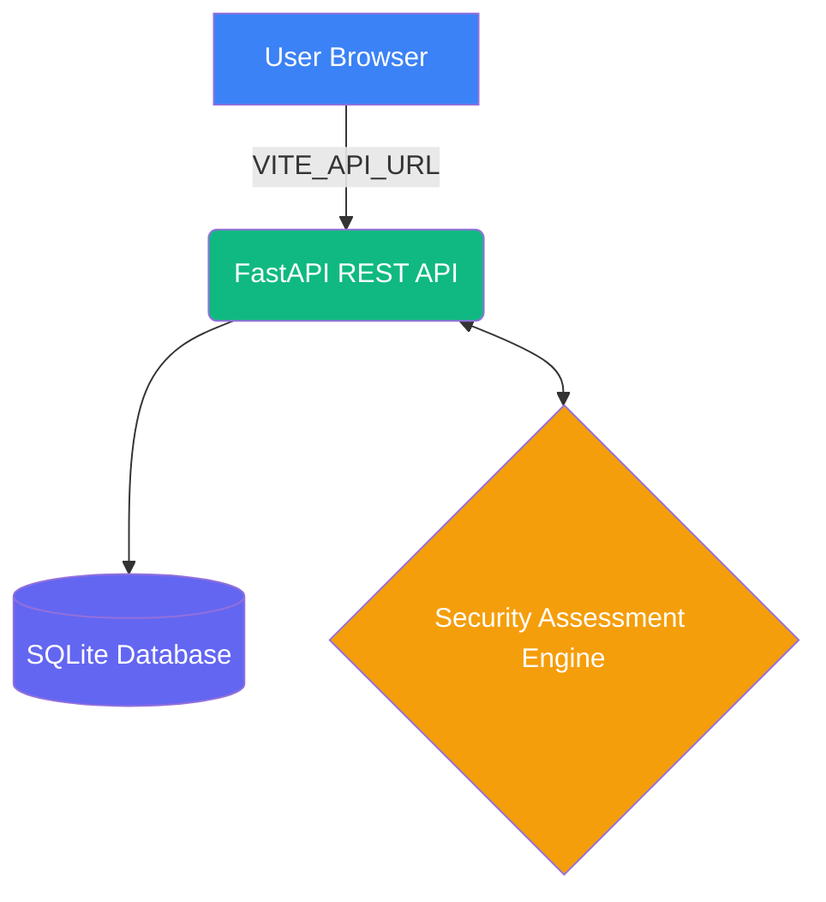
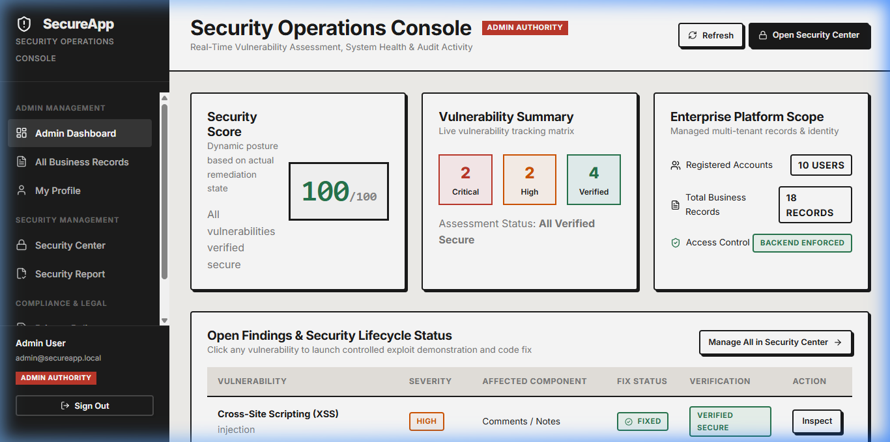
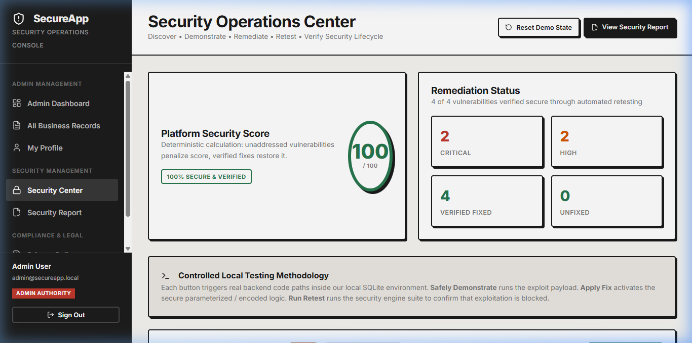
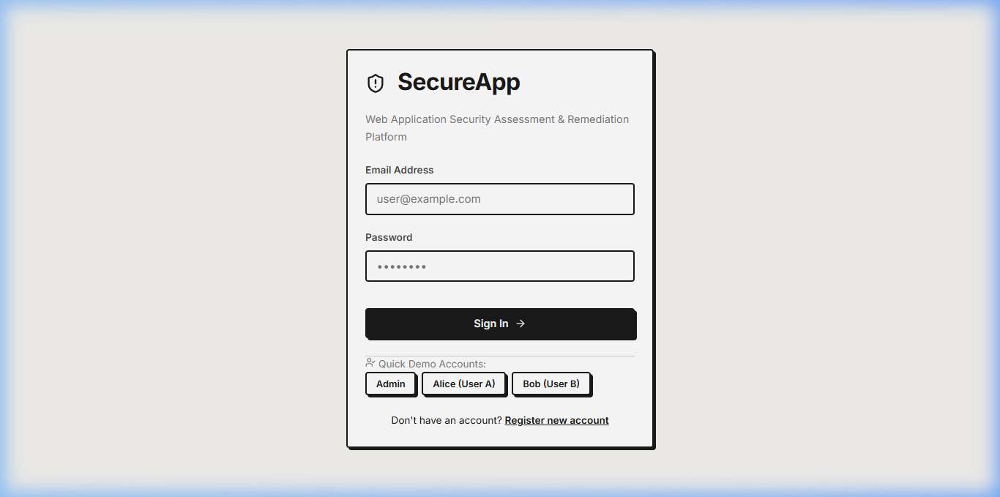
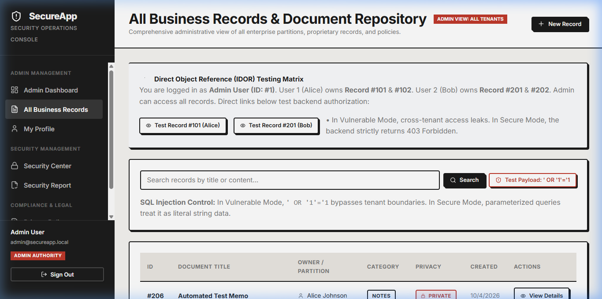

# 🛡️ SecureApp
**Web Application Security Assessment & Remediation Platform**

> **ALGOTHON'26 · Problem Statement ID: ALG-CYBER-02 · Secure the Application**

[](#)
[](#)
[](#)
[](#)
[](#)

SecureApp is an educational cybersecurity platform that demonstrates the complete security lifecycle against its own intentionally vulnerable local application:

**DISCOVER → IDENTIFY → SAFELY DEMONSTRATE → FIX → RETEST → VERIFY → REPORT**

---

## 📖 Project Overview

SecureApp acts as a realistic small-business web application (managing records, documents, comments, and users) that intentionally contains four categories of critical security vulnerabilities. 

It features a built-in **Security Center** that discovers these flaws, safely demonstrates their impact in a controlled local environment, applies secure code fixes in real-time, automates retesting to verify the fixes, and generates print-ready audit reports.

> **Note:** No external systems, third-party targets, or real user data are ever involved. SecureApp is entirely self-contained.

---

## 🏗️ Architecture



### The Security Lifecycle
1. **Discover** — Listed in Security Center with severity, root cause, and impact.
2. **Demonstrate** — Real backend test with evidence output.
3. **Fix** — Activates the secure code path (parameterized queries, HTML encoding, ownership checks, bcrypt).
4. **Retest** — Automated re-execution to verify the fix blocks the exploit.
5. **Report** — Audit-ready evidence with timestamps.

---

## 📸 Visual Overview

Here are a few screenshots showcasing the platform in action.

| **Admin Dashboard** | **Security Center** |
|:---:|:---:|
|  |  |
| **Login Page** | **Records & Vulnerability Testing** |
|  |  |

---

## 🛠️ Technology Stack

| Layer     | Technology                          |
|-----------|-------------------------------------|
| **Frontend**  | React 19, Vite 8, Vanilla CSS       |
| **Backend**   | Python 3.14, FastAPI, Pydantic      |
| **Database**  | SQLite 3 (Idempotent initialization)|
| **Auth**      | JWT (HS256), bcrypt password hashing|
| **Testing**   | Pytest (11 automated tests)         |
| **Deployment**| Render Blueprint (`render.yaml`)    |

---

## 🐛 Vulnerabilities Implemented & Mitigated

| # | Vulnerability                        | OWASP Category | Severity | Affected Component       |
|---|--------------------------------------|----------------|----------|--------------------------|
| 1 | **SQL Injection**                    | A03:2021       | 🔴 Critical | Record Search / Lookup   |
| 2 | **Cross-Site Scripting (XSS)**       | A03:2021       | 🔴 Critical | Comments / Notes         |
| 3 | **Broken Access Control (IDOR)**     | A01:2021       | 🟠 High     | Record Details API       |
| 4 | **Broken Authentication**            | A07:2021       | 🟠 High     | Login / Session Mgmt   |

---

## 🚀 Setup & Deployment

### Local Development

**Prerequisites:** Python 3.10+ and Node.js 18+

1. **Backend Setup:**
```bash
cd backend
python -m pip install -r requirements.txt
python -m uvicorn app.main:app --host 127.0.0.1 --port 8000
```
*(The SQLite database is created and seeded automatically on first startup)*

2. **Frontend Setup:**
```bash
cd frontend
npm install
npm run dev
```
Open **http://localhost:5173** in your browser.

### Render Deployment (1-Click)
This project is configured for a zero-configuration deployment on Render.
1. Fork or push this repository to your GitHub.
2. Go to Render Dashboard → **Blueprints** → **New Blueprint Instance**.
3. Connect your repository. Render will automatically read the `render.yaml` file and deploy both the FastAPI backend and React frontend.

---

## 👥 Demo Accounts & RBAC

| Role   | Email                      | Password    | Dashboard Access |
|--------|----------------------------|-------------|------------------|
| **Admin**  | `admin@secureapp.local`      | `Admin@123`   | Full Access + Security Center |
| **User A** | `alice@secureapp.local`      | `Alice@123`   | Personal Records Only |
| **User B** | `bob@secureapp.local`        | `Bob@12345`   | Personal Records Only |

*(Quick-fill buttons are available on the login page for convenience)*

---

## 🧪 Testing & Validation

Run the automated test suite to verify the application logic and security lifecycle:

```bash
cd backend
python -m pytest tests -v
python verify_roles.py
```

**Test Coverage Includes:**
- Authentication (login, register, password policy)
- Record CRUD and comment sanitization
- Full security lifecycle (demo → fix → retest → score=100)
- Role-Based Access Control (RBAC) and IDOR isolation checks

---

## 🔒 Security Considerations Applied

- ✅ Passwords hashed with **bcrypt** (salted, one-way)
- ✅ **JWT tokens** securely validated on all protected endpoints
- ✅ Strict server-side input validation via **Pydantic**
- ✅ HTML output encoding for **XSS prevention**
- ✅ **Parameterized SQL queries** to prevent injection
- ✅ Dynamic **CORS rules** mapping to environment variables
- ✅ Global error handler (no stack traces exposed to clients)
- ✅ Security headers middleware (`X-Content-Type-Options`, `X-Frame-Options`, `X-XSS-Protection`)

---

## 📁 Project Structure

```
SecureApp-ALGOTHON26/
├── backend/
│   ├── app/                 # FastAPI application core
│   │   ├── security/        # Assessment engine & vulnerability lifecycle
│   │   ├── routes/          # REST API endpoints
│   │   └── database/        # SQLite connection & safe seeding
│   └── tests/               # Pytest automated testing suite
├── frontend/
│   ├── public/              # Static assets, robots.txt, render SPA routing
│   └── src/                 # React application source
├── docs/                    # Architecture, Demo Guide, Security Reports
├── render.yaml              # Deployment blueprint
└── README.md
```

---

> **For Judges / Evaluators:** Please refer to the [Demo Guide](./docs/demo-guide.md) for a structured 5–8 minute walkthrough of the application's full security capabilities.

**ALGOTHON'26 — Team SecureApp**
